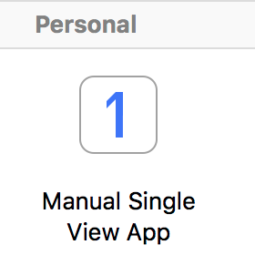
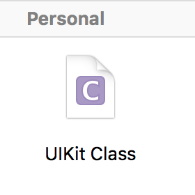
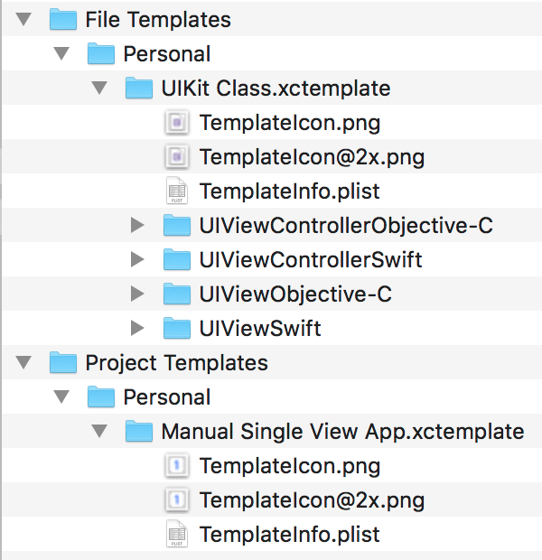

## Xcode File And Project Templates

This repository contains custom Xcode file and project templates. See below for a full description and installation details.

### Project Templates

The project templates appear in a `Personal` group in the template browser. You can change the name of this group by changing the installation folder.

+ **Manual Single View App:** This template builds on the Xcode single view app template but does not use a Storyboard. It creates the window and root view controller manually in the App Delegate. Project options allow you to choose the name of the view controller class and whether to embed it in a navigation controller.

### File Templates

The file templates appear in a `Personal` group in the template browser. You can change the name of this group by changing the installation folder.

+ **UIKit Class:** Custom `UIView` and `UIViewController` file templates that call a private `setupView` method to add views and constraints. The configuration options are similar to the default Cocoa Touch Class file templates.

### Installation

1. If it does not yet exist create the `Project Templates` and `File Templates` folders under your home directory:

        $ mkdir -p ~/Library/Developer/Xcode/Templates/Project\ Templates
        $ mkdir -p ~/Library/Developer/Xcode/Templates/Files\ Templates

2. Copy the contents of the `Project Templates` and `File Templates` folders in this repository into the above folders.

3. The templates appear in the Xcode file and project template browsers under a `Personal` group. You can change the name of this group by renaming the installation folder in the `File Templates` or `Project Templates` folders:

### Further Details

See this blog post for more details on creating custom Xcode project templates:

+ [Creating Custom Xcode Project Templates](https://useyourloaf.com/blog/creating-custom-xcode-project-templates/)
